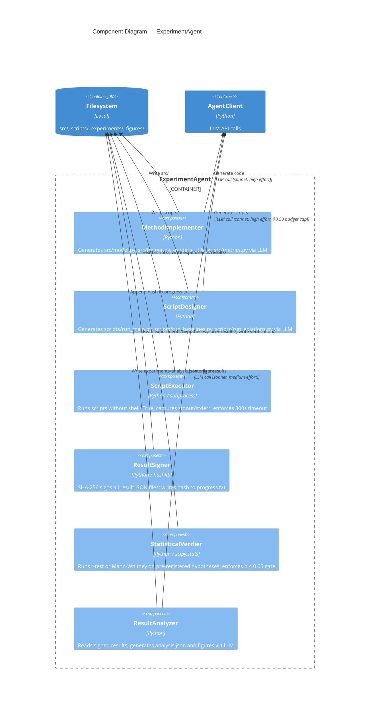

# C4 Component Diagram — ExperimentAgent

The ExperimentAgent is the most complex container. This diagram shows its internal components.

```mermaid
C4Component
    title Component Diagram — ExperimentAgent

    Container_Boundary(exp, "ExperimentAgent") {
        Component(impl, "MethodImplementer", "Python", "Generates src/model.py, src/trainer.py, src/data_utils.py, src/metrics.py via LLM")
        Component(designer, "ScriptDesigner", "Python", "Generates scripts/run_main.py, scripts/run_baselines.py, scripts/run_ablations.py via LLM")
        Component(executor, "ScriptExecutor", "Python / subprocess", "Runs scripts without shell=True; captures stdout/stderr; enforces 300s timeout")
        Component(hasher, "ResultSigner", "Python / hashlib", "SHA-256 signs all result JSON files; writes hash to progress.txt")
        Component(stats, "StatisticalVerifier", "Python / scipy.stats", "Runs t-test or Mann-Whitney on pre-registered hypotheses; enforces p < 0.05 gate")
        Component(analyzer, "ResultAnalyzer", "Python", "Reads signed results; generates analysis.json and figures via LLM")
    }

    ContainerDb(fs, "Filesystem", "Local", "src/, scripts/, experiments/, figures/")
    Container(client, "AgentClient", "Python", "LLM API calls")

    Rel(impl, client, "Generate code", "LLM call (sonnet, high effort)")
    Rel(designer, client, "Generate scripts", "LLM call (sonnet, high effort, $0.50 budget cap)")
    Rel(impl, fs, "Write src/")
    Rel(designer, fs, "Write scripts/")
    Rel(executor, fs, "Read scripts/; write experiments/results/")
    Rel(hasher, fs, "Append hash to progress.txt")
    Rel(stats, fs, "Read experiments/hypotheses.json + results/; write verification/")
    Rel(analyzer, client, "Interpret results", "LLM call (sonnet, medium effort)")
    Rel(analyzer, fs, "Write experiments/analysis.json + figures/")
```
