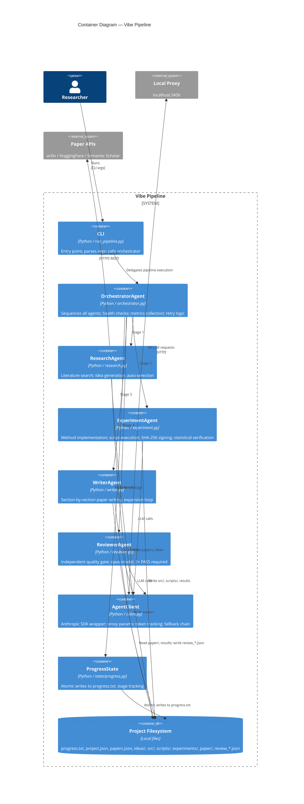

# C4 Container Diagram

```mermaid
C4Container
    title Container Diagram — Vibe Pipeline

    Person(researcher, "Researcher")

    System_Boundary(vibe, "Vibe Pipeline") {
        Container(cli, "CLI", "Python / run_pipeline.py", "Entry point; parses args; calls orchestrator")
        Container(orch, "OrchestratorAgent", "Python / orchestrator.py", "Sequences all agents; health checks; metrics collection; retry logic")
        Container(research, "ResearchAgent", "Python / research.py", "Literature search; idea generation; auto-selection")
        Container(experiment, "ExperimentAgent", "Python / experiment.py", "Method implementation; script execution; SHA-256 signing; statistical verification")
        Container(writer, "WriterAgent", "Python / writer.py", "Section-by-section paper writing; expansion loop")
        Container(reviewer, "ReviewerAgent", "Python / reviewer.py", "Independent quality gate; opus model; 2× PASS required")
        Container(client, "AgentClient", "Python / client.py", "Anthropic SDK wrapper; proxy params; token tracking; fallback chain")
        Container(state, "ProgressState", "Python / state/progress.py", "Atomic writes to progress.txt; stage tracking")
        ContainerDb(fs, "Project Filesystem", "Local files", "progress.txt, project.json, papers.json, ideas/, src/, scripts/, experiments/, paper/, review_*.json")
    }

    System_Ext(proxy, "Local Proxy", "localhost:3456")
    System_Ext(apis, "Paper APIs", "arXiv / HuggingFace / Semantic Scholar")

    Rel(researcher, cli, "Runs", "CLI args")
    Rel(cli, orch, "Delegates pipeline execution")
    Rel(orch, research, "Stage 1")
    Rel(orch, experiment, "Stage 2")
    Rel(orch, writer, "Stage 3")
    Rel(orch, reviewer, "Stage 4")
    Rel(research, client, "LLM calls")
    Rel(experiment, client, "LLM calls")
    Rel(writer, client, "LLM calls")
    Rel(reviewer, client, "LLM calls")
    Rel(client, proxy, "All LLM requests", "HTTP")
    Rel(research, apis, "Paper search", "HTTPS REST")
    Rel(orch, state, "Read/write stage")
    Rel(research, fs, "Write papers, ideas")
    Rel(experiment, fs, "Write src/, scripts/, results")
    Rel(writer, fs, "Write paper/")
    Rel(reviewer, fs, "Read paper/, results; write review_*.json")
    Rel(state, fs, "Atomic writes to progress.txt")
```
