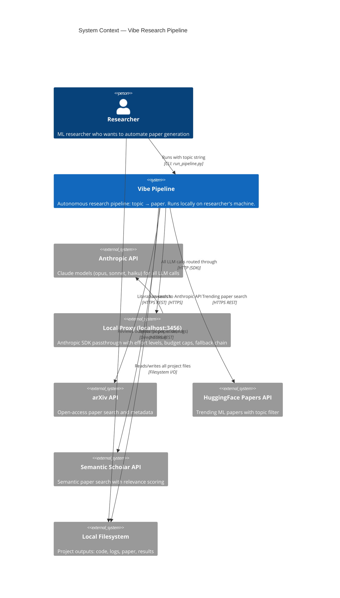

# C4 Context Diagram

```mermaid
C4Context
    title System Context — Vibe Research Pipeline

    Person(researcher, "Researcher", "ML researcher who wants to automate paper generation")

    System(vibe, "Vibe Pipeline", "Autonomous research pipeline: topic → paper. Runs locally on researcher's machine.")

    System_Ext(anthropic, "Anthropic API", "Claude models (opus, sonnet, haiku) for all LLM calls")
    System_Ext(proxy, "Local Proxy (localhost:3456)", "Anthropic SDK passthrough with effort levels, budget caps, fallback chain")
    System_Ext(arxiv, "arXiv API", "Open-access paper search and metadata")
    System_Ext(hf, "HuggingFace Papers API", "Trending ML papers with topic filter")
    System_Ext(s2, "Semantic Scholar API", "Semantic paper search with relevance scoring")
    System_Ext(fs, "Local Filesystem", "Project outputs: code, logs, paper, results")

    Rel(researcher, vibe, "Runs with topic string", "CLI: run_pipeline.py")
    Rel(vibe, proxy, "All LLM calls routed through", "HTTP (SDK)")
    Rel(proxy, anthropic, "Forwards to Anthropic API", "HTTPS")
    Rel(vibe, arxiv, "Literature search", "HTTPS REST")
    Rel(vibe, hf, "Trending paper search", "HTTPS REST")
    Rel(vibe, s2, "Semantic paper search", "HTTPS REST")
    Rel(vibe, fs, "Reads/writes all project files", "Filesystem I/O")
    Rel(researcher, fs, "Reviews outputs (paper, code, logs)", "Direct access")
```
