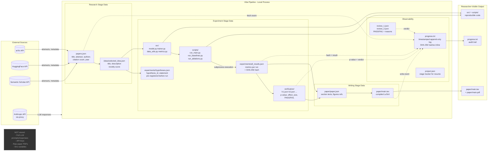

# Data Flow Diagram

Shows how data enters, moves through, and exits the Vibe pipeline.
What is stored, what is logged, and what stays in-memory only.

## Data Classification

| Data | Classification | Storage | Transmitted to API? |
|------|---------------|---------|---------------------|
| Paper abstracts (from APIs) | Public | `context/papers.json` | Yes (in LLM prompts) |
| Research idea | Researcher's IP | `ideas/selected_idea.json` | Yes (in LLM prompts) |
| Generated code | Researcher's IP | `src/`, `scripts/` | Yes (in LLM prompts) |
| Experiment results | Researcher's IP | `experiments/` | Yes (in LLM prompts) |
| Paper sections | Researcher's IP | `paper/` | Yes (in LLM prompts) |
| Anthropic API key | Secret | Environment variable only | No (sent as HTTP header, not in prompt) |
| Pipeline log | Operational | `progress.txt` | No |
| SHA-256 hashes | Integrity | `progress.txt` inline | No |
