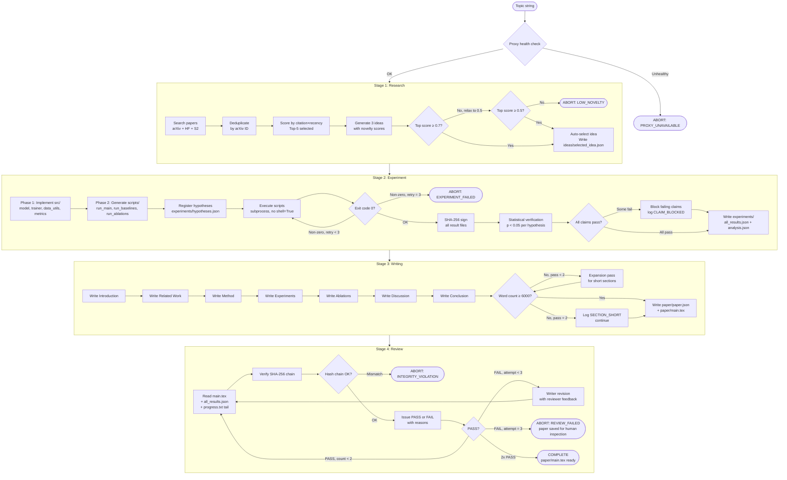

# Workflow Diagram — Pipeline Execution

```mermaid
flowchart TD
    START([Topic string]) --> HEALTH{Proxy health check}
    HEALTH -- Unhealthy --> ABORT_PROXY([ABORT: PROXY_UNAVAILABLE])
    HEALTH -- OK --> RESEARCH

    subgraph RESEARCH [Stage 1: Research]
        R1[Search papers\narXiv + HF + S2] --> R2[Deduplicate\nby arXiv ID]
        R2 --> R3[Score by citation×recency\nTop-5 selected]
        R3 --> R4[Generate 3 ideas\nwith novelty scores]
        R4 --> R5{Top score ≥ 0.7?}
        R5 -- No, relax to 0.5 --> R4B{Top score ≥ 0.5?}
        R4B -- No --> ABORT_NOVELTY([ABORT: LOW_NOVELTY])
        R4B -- Yes --> R6
        R5 -- Yes --> R6[Auto-select idea\nWrite ideas/selected_idea.json]
    end

    RESEARCH --> EXPERIMENT

    subgraph EXPERIMENT [Stage 2: Experiment]
        E1[Phase 1: Implement src/\nmodel, trainer, data_utils, metrics] --> E2[Phase 2: Generate scripts/\nrun_main, run_baselines, run_ablations]
        E2 --> E3[Register hypotheses\nexperiments/hypotheses.json]
        E3 --> E4[Execute scripts\nsubprocess, no shell=True]
        E4 --> E5{Exit code 0?}
        E5 -- Non-zero, retry < 3 --> E4
        E5 -- Non-zero, retry = 3 --> ABORT_EXP([ABORT: EXPERIMENT_FAILED])
        E5 -- OK --> E6[SHA-256 sign\nall result files]
        E6 --> E7[Statistical verification\np < 0.05 per hypothesis]
        E7 --> E8{All claims pass?}
        E8 -- Some fail --> E9[Block failing claims\nlog CLAIM_BLOCKED]
        E9 --> E10[Write experiments/\nall_results.json + analysis.json]
        E8 -- All pass --> E10
    end

    EXPERIMENT --> WRITING

    subgraph WRITING [Stage 3: Writing]
        W1[Write Introduction] --> W2[Write Related Work]
        W2 --> W3[Write Method]
        W3 --> W4[Write Experiments]
        W4 --> W5[Write Ablations]
        W5 --> W6[Write Discussion]
        W6 --> W7[Write Conclusion]
        W7 --> W8{Word count ≥ 6000?}
        W8 -- No, pass < 2 --> W9[Expansion pass\nfor short sections]
        W9 --> W8
        W8 -- No, pass = 2 --> W10[Log SECTION_SHORT\ncontinue]
        W8 -- Yes --> W11[Write paper/paper.json\n+ paper/main.tex]
        W10 --> W11
    end

    WRITING --> REVIEW

    subgraph REVIEW [Stage 4: Review]
        RV1[Read main.tex\n+ all_results.json\n+ progress.txt tail] --> RV2[Verify SHA-256 chain]
        RV2 --> RV3{Hash chain OK?}
        RV3 -- Mismatch --> ABORT_HASH([ABORT: INTEGRITY_VIOLATION])
        RV3 -- OK --> RV4[Issue PASS or FAIL\nwith reasons]
        RV4 --> RV5{PASS?}
        RV5 -- FAIL, attempt < 3 --> RV6[Writer revision\nwith reviewer feedback]
        RV6 --> RV1
        RV5 -- FAIL, attempt = 3 --> ABORT_REVIEW([ABORT: REVIEW_FAILED\npaper saved for human inspection])
        RV5 -- PASS, count < 2 --> RV1
        RV5 -- 2x PASS --> COMPLETE([COMPLETE\npaper/main.tex ready])
    end
```
